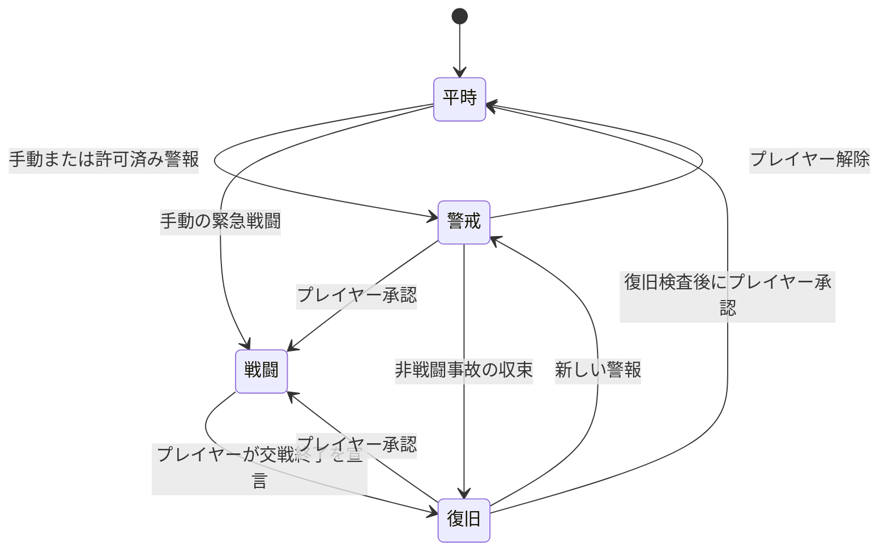

# 帝国軍務教範の状態機械

帝国軍務教範は、プレイヤーが選んだ運用態勢を、登録済みの部隊、部署、区域、設備へ差分適用する。教範は戦闘対象や戦術を判断せず、RimWorld 1.6と公式DLCが所有するPawn、方針、区域、仕事、設備の状態を一括して変更する。

## 正本状態

活動中の各マップでは、教範用`MapComponent`が次を正本として保存する。複数マップまたは艦隊を束ねる場合、`WorldComponent`は司令圏と親子関係だけを保存し、マップ上のPawn、区域、設備、セル座標を所有し直さない。

| データ | 内容 |
|---|---|
| `scopeId` | 司令圏、区域、部隊を識別する安定ID |
| `parentScopeId` | 上位司令圏。存在しない場合はマップ直下 |
| `inheritanceMode` | `継承`、`固定`、`職務例外` |
| `requestedPosture` | プレイヤーまたは許可済み警報が要求した態勢 |
| `effectivePosture` | 最後に検証を完了した実態勢 |
| `applicationState` | 現在の検証、適用、部分適用、安全停止状態 |
| `profileId` | 各態勢で使う部隊・部署別Profile |
| `memberRefs` | 登録Pawn、設備、区域への参照と安定した役割枠 |
| `manualOverrides` | プレイヤーまたは外部処理が変更した項目 |
| `transitionRecord` | 遷移ID、操作順、発令済み操作、結果、失敗理由 |

表示用の行、並び順、検索索引、到達可能セル候補は派生キャッシュとし、保存しない。ロード後に正本状態とバニラの現在値から再構築する。

## 二軸の状態

### 運用態勢

運用態勢は`平時`、`警戒`、`戦闘`、`復旧`の四つとする。

| 態勢 | 適用する主なProfile |
|---|---|
| 平時 | 通常区域、勤務表、作業優先度、服装・薬物方針、補給基準 |
| 警戒 | 集合・避難区域、戦闘服準備、携行品、医薬品・弾薬・燃料の不足検査、警戒設備 |
| 戦闘 | 指定部隊の徴兵、射撃許可、保存隊形への移動、後方医療、機関・避難配置 |
| 復旧 | 段階的な徴兵解除、救助、治療、消火、除染、搬出、修理、回収、再補給 |

`戦闘`は全Pawnの徴兵を意味しない。部隊Profileは、小銃分隊、砲兵・観測班、医療予備隊、機関・整備班、民間人、偵察・爆撃班等の役割ごとに異なる処理を持つ。

### 適用状態

一回の遷移は、次の適用状態を進む。

```text
安定
  → 要求済み
  → 検証中
  → 方針適用中
  → 命令適用中
  → 確認中
  → 安定

途中結果: 部分適用
停止結果: 安全停止
```

UIは希望態勢と実態勢を分け、`警戒 → 戦闘、命令適用 74/100`のように表示する。百人へ一括操作する場合も、全命令を同一Tickへ集中させない。

## 運用態勢の遷移



| 遷移 | 発令権限 | ガード | 結果 |
|---|---|---|---|
| 平時→警戒 | 手動、またはプレイヤーが許可した警報Adapter | 有効な司令圏と警戒Profileがある | 避難、集合、準備、在庫不足検査を開始する |
| 平時→戦闘 | 手動のみ | 対象部隊と作戦基準点を確認する | 警戒を経由せず緊急戦闘Transactionを開始する |
| 警戒→戦闘 | 手動のみ | 徴兵対象、隊形、手動例外、不可逆な別操作を表示する | 指定部隊だけを戦闘Profileへ移す |
| 警戒→平時 | 手動のみ | 実行中の命令と残る危険を表示する | 安全に戻せる方針を平時Profileへ戻す |
| 警戒→復旧 | 手動のみ | 非戦闘事故の後処理対象がある | 復旧作業Profileを適用する |
| 戦闘→復旧 | 手動のみ | 交戦中の敵がいる場合は警告する | 攻撃判断を止めず、教範が発令した徴兵を段階解除する |
| 復旧→平時 | 手動のみ | 復旧検査を実行する | 合格または理由を承認した後に平時Profileを適用する |
| 復旧→警戒 | 手動、または許可済み警報 | 新しい脅威または警戒理由がある | 復旧Queueを中断し、警戒を優先する |
| 復旧→戦闘 | 手動のみ | 対象部隊を再確認する | 未完の復旧を記録して戦闘へ再投入する |

自動遷移は`警戒`への引上げまでとする。警報が消えても自動的に平時へ戻さない。敵影消失は`復旧へ`の提案を表示するだけで、戦闘終了を決定しない。

## 階層継承

教範の司令範囲は次の階層を持つ。

```text
司令圏（入植地、艦、作戦群）
└─ 区域（マップ、甲板、上陸地点）
   └─ 部隊・部署
      └─ 個人の手動例外
```

- `継承`は親の希望態勢へ追随する。
- `固定`は親が遷移しても現在態勢を維持する。
- `職務例外`は親と同じ態勢名を使いながら、医療、機関、民間等の別Profileを適用する。

子範囲は親より先に警戒または戦闘へ移行できる。この場合、親は自動遷移せず、`一個部隊が戦闘中`と表示する。親を下位態勢へ戻す操作は、固定中、手動例外中、またはより高い態勢にある子を解除しない。

マップ移動時は態勢、名簿、役割枠、Profileだけを維持する。セル座標に依存する集合地点と隊形は失効させ、到着先で基準点を選び直してから発令する。

## 遷移Transaction

各遷移には安定した`transitionId`を付け、次の順で実行する。

1. 要求された司令圏、対象、Profile、現在値の版を確定する。
2. 適用対象数、除外理由、手動例外、在庫不足、無効な隊形セル、別確認を要する操作を事前表示する。
3. 必須ガードを満たした場合だけTransactionを開始する。
4. 区域、勤務、服装、薬物、医療、作業等の経路探索を伴わない方針を有界Queueで適用する。
5. 徴兵、移動、服用、移送等のJobまたは経路探索を伴う命令を別Queueで適用する。
6. 現在値を再検証し、`適用済み`、`既に一致`、`保留`、`除外`、`手動例外`、`拒否`を集計する。
7. 全必須操作が成立すれば希望態勢を実態勢にする。成立しない対象が残れば、希望態勢と`部分適用`を維持する。

同じ`transitionId`と操作IDを再実行しても、既に成立した方針、発令済みの移動、服用済みの薬物を重複適用しない。

## 割込みと取消

警戒または戦闘への引上げは、平時復元や復旧中の低優先度Queueへ割り込める。割込み時は未発令操作を取消し、成立済みの操作を逆順で自動取消ししない。新しい希望態勢と現在値から差分を再計画する。

プレイヤーの`教範停止`は未発令操作を停止する。移動済みのPawn、閉じた扉、消費済み物資、服用済み薬物には逆操作を発行しない。UIは次の再開方法を示す。

- 現在値から再計算
- 保留分だけ再試行
- 安全に戻せる方針だけ復元
- 希望態勢を破棄して現在値を採用

## 手動上書き

プレイヤーが教範適用後に区域、勤務、服装、徴兵等を変更した場合、その対象と項目を`手動例外`にする。教範は定期監視で値を戻さず、再同期を命じられるまで例外を維持する。

平時中の手動変更は、個人例外として残すか、平時Profileの新しい基準へ採用できる。外部MODによる変更を判別できない場合も同じく外部例外として扱い、黙って上書きしない。

## 復旧検査

復旧から平時へ戻る前に、登録対象について次を検査する。

- 未救助の味方と到達不能な患者
- 制御不能な火災
- 未処理の汚染、破口、収容違反
- 教範命令Queueの保留と安全停止
- 必須装備、医薬品、弾薬、燃料の不足
- 修理、回収、再補給の未完了

未達項目があってもプレイヤーは平時移行を承認できる。教範は不足を消さず、対象、理由、再試行条件を平時の警告として残す。

## 保存と復旧

教範は希望態勢、実態勢、Profile、司令圏、名簿、手動例外、Transition ID、各操作の発令状態と結果を保存する。バニラのPawn tracker、Bill、Jobは各バニラ所有者の保存へ委ねる。

ロード後は、保存した希望値とバニラの現在値から未完操作を再構築する。発令済みの移動、移送、服用は自動再発令せず、現在状態が不一致なら`再確認待ち`にする。死亡、離脱、別マップ移動、削除済み区域、削除済み方針は`除外`として記録し、ロードを失敗させない。

## 失敗結果

| 条件 | 保証する結果 |
|---|---|
| 司令圏またはProfileが解決できない | 何も変更せずTransactionを拒否する |
| 隊形の必須セルが無効 | 隊形移動群を発令せず、独立した方針群だけ適用できる |
| 装備または薬物が不足 | 代用品を勝手に選ばず、不足対象を保留する |
| Pawnが死亡、ダウン、精神崩壊、離脱した | そのPawnの未発令操作を除外し、他対象を継続する |
| 適用中にプレイヤーが同じ項目を変更した | その項目を手動例外にして教範操作を停止する |
| 保存時に命令結果が確定していない | ロード後に不可逆操作を再発令せず、再確認を要求する |
| Queueが処理予算を超えた | 操作を破棄せず、件数、待機理由、予想進捗を表示する |

安全停止は、勝手な徴兵解除、保安扉の開放、薬物服用、逆方向の移動を行わない。

## 性能条件

- 全Pawn、全Thing、全設備を毎Tick走査しない。
- UI操作、態勢要求、名簿変更、登録対象の変更、対応警報を契機にdirty Queueへ積む。
- 非経路方針は一Tick当たり最大16～32 Pawn、役職等の重い再計算は最大4 Pawn、Job・経路探索・服用・移送は最大2～4 Pawnへ発令する。
- 補助整合検査は250～1000 Tickへ分散し、登録対象だけを検査する。
- UIは可視行とdirty行だけを更新し、閉じている間は一覧の再集計を行わない。
- 100カエラヴィ、60ドライアド、24収容体の検証セーブで、教範の待機時追加負荷を平均`0.01ms/tick`未満、適用Queue稼働時の独自処理を平均`0.15ms/tick`以下とする。これは実機測定前の設計予算である。
- 経路探索を含むMax値、Queue排出時間、UI frame時間を[ログ・性能診断契約](/design/53-RimWorldログ・性能診断契約.md)に従って実測する。

## 受入条件

1. 平時、警戒、戦闘、復旧の全遷移を百人の登録Pawnで実行し、希望態勢、実態勢、進捗を別表示できる。
2. 戦闘への遷移、攻撃対象、能力使用はプレイヤー決定のまま維持される。
3. 手動上書きを次のTickで奪い返さず、対象項目だけを例外表示できる。
4. Transactionの取消、保存、ロード、Pawn死亡、Map移動後に不可逆操作を重複発令しない。
5. 新しい警報が復旧Queueへ安全に割り込み、未発令操作を失わず再計画できる。
6. 性能予算を同一セーブのMOD無効・有効差分で測定し、AverageとMaxを記録する。

## 関連項目

- 上位索引: [全体設計](/design/index.md)
- 世界内制度: [帝国軍務教範](/world/44-帝国軍務教範.md)
- 一括操作: [帝国軍務教範の一括操作境界](/design/59-帝国軍務教範の一括操作境界.md)
- 性能方針: [性能方針](/design/23-パフォーマンス方針.md)
- UI方針: [操作画面と情報予算](/design/24-UIと情報予算.md)
- 計測契約: [RimWorldログ・性能診断契約](/design/53-RimWorldログ・性能診断契約.md)
