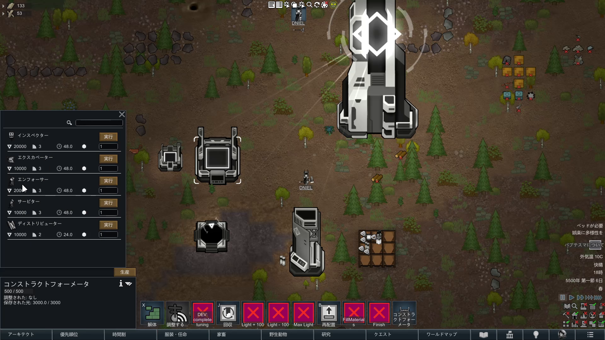
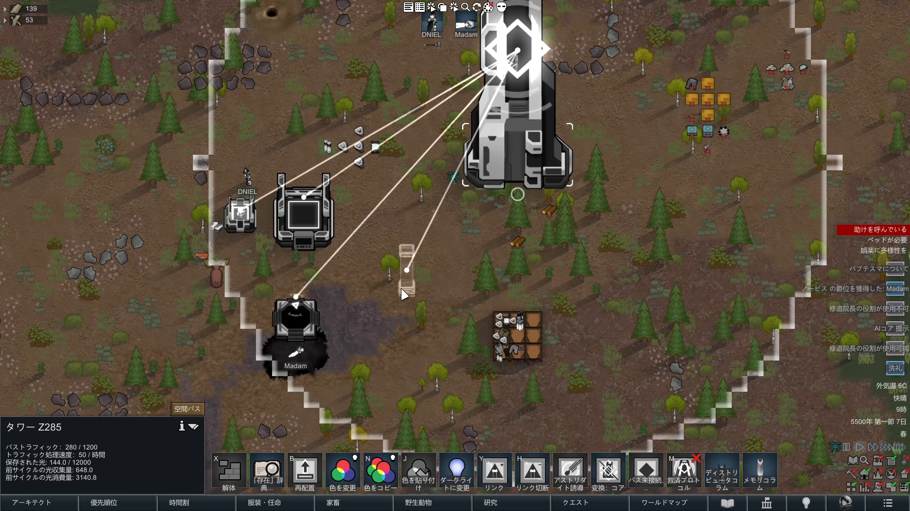

# 1. MonolynのネットワークUIから採るもの

生産画面は、現在の集中資源量と、各製品の費用・所要時間・数量・実行操作を同じ文脈へ置いている。Kombinatでは光に限定せず、選択中の製品、必要な実Thing、予約済み量、不足量、予定時間、出力先、実行不能理由を一画面で読める構成へ置き換える。

採用するのは「資源残量と生産判断を離さない」という情報設計であり、Lightという固有資源や画面構成の複製ではない。

ネットワーク表示は、建築物を選択した時だけ範囲と接続線を示し、通常画面の視認性を維持している。Core独自基盤では次を採用する。

- 選択中のノードを起点に、接続先と方向を表示する。
- 入庫、出庫、双方向、停止、遮断を線色または線種で区別する。
- 転送時だけ短いパルスを表示し、常時アニメーションを避ける。
- 処理量、予約量、保管量、詰まり理由をInspectorへ要約する。
- 通常時は線を隠し、必要な時だけ全ネットワークOverlayを切り替える。

接続線は説明用表示であり、ThingがMap上を線に沿って移動することを意味しない。

## 関連項目

- 上位索引: [kombinat-ui-references](/research/kombinat-ui-references/index.md)
- 既存の構造研究: [Monolyn Race structural lessons](/research/reference-mods/03-Monolyn-Race-structural-lessons-参考MOD調査.md)
- 正規UI仕様: [Kombinat UI](/kombinat/core/09-UI-操作画面.md)
- 性能方針: [パフォーマンス方針](/design/23-パフォーマンス方針.md)
