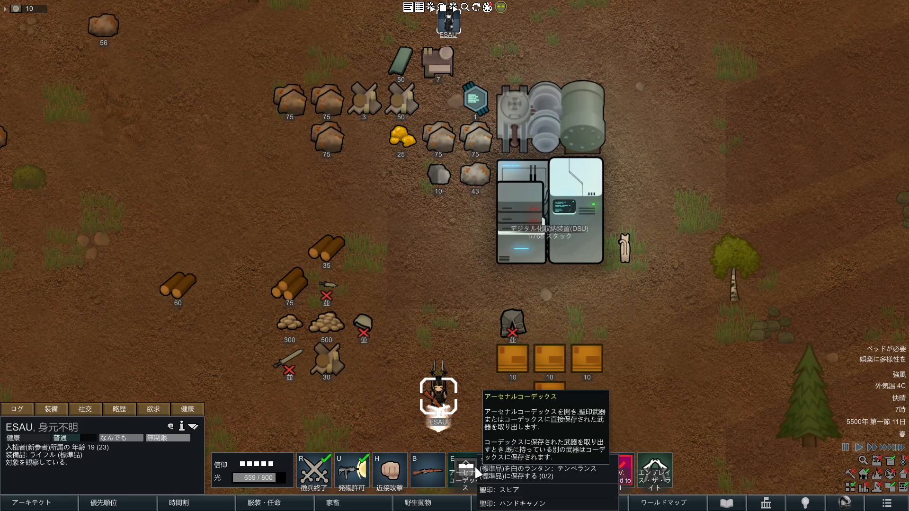

# 2. Arsenal Codexの直接交換から採るもの

映像では、Pawnから接続保管庫の武器一覧を開き、選んだ武器を直接装備している。交換前の武器は同じ保管庫へ戻され、地面へのDropとPawn運搬を挟まない。

この操作モデルはCoreの接続装備庫に適合する。ただし正規仕様では、単なる見かけ上の交換ではなく次を一つの原子的取引として保証する。

1. 新しい武器と旧武器の受取先を予約する。
2. 同じ武器Thingの品質、耐久、弾薬、発熱、固有番号を維持する。
3. 旧武器の返却と新武器の装備を一回の操作で確定する。
4. 途中失敗時は交換前の状態へ戻し、複製・消失・不意の武装解除を起こさない。

これは自動物流が通常Map空間を通らない原則の、最も分かりやすいプレイヤー向け表現である。Pawnが手動で地上品を拾う通常行動や、戦闘中の通常装備操作までは禁止しない。

## 関連項目

- 上位索引: [kombinat-ui-references](/research/kombinat-ui-references/index.md)
- 正規武器転送仕様: [装備庫接続と武器転送の実装境界](/design/50-装備庫接続と武器転送の実装境界.md)
- 正規保管基盤: [Core独自保管・接続システムの実装境界](/design/51-Core独自保管接続システムの実装境界.md)
