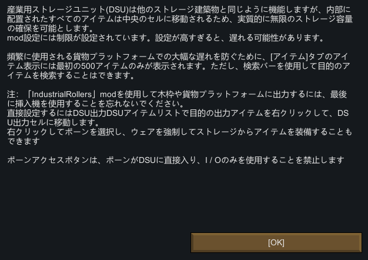
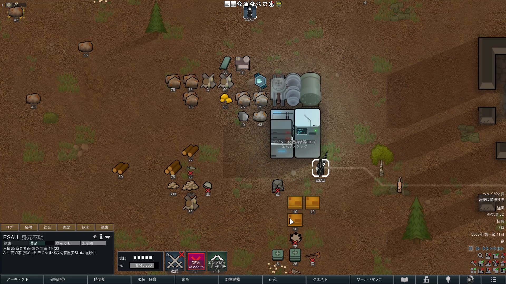

# 3. DSUから採るUIと採らない実装

DSUから参照する価値があるのは、膨大な内容物を検索できること、選択した内容物を任意に出せること、Pawnアクセスを制御できること、現在量を簡潔に表示することである。

Core独自保管・接続システムでは次を採用する。

- 名称、種類、品質、材質等による検索・絞り込み。
- 合計、予約済み、利用可能の区別。
- 選択数、指定数、全量の手動排出。
- Pawnの直接利用を許可、禁止、限定するAccess Policy。
- 大量在庫でも500件固定打切りではなく、ページングまたは仮想化した一覧。

一方、内容物を建物中央のMapセルへ移して容量を事実上拡張する方式は採用しない。この方式は、通常運用の搬入・搬送・判断をMap空間から外すというCoreの原則と一致せず、Map上のThing数や特殊な重なりへ依存する。

正規実装は、保管建築が所有する非Spawn状態の`ThingOwner`へ実Thingを保持し、接続Endpoint間を直接引き渡す。Map上へ出すのは、プレイヤーが明示的に排出した時、または復旧・破壊処理で安全に返却する時だけである。

## 関連項目

- 上位索引: [kombinat-ui-references](/research/kombinat-ui-references/index.md)
- 正規実装境界: [Core独自保管・接続システムの実装境界](/design/51-Core独自保管接続システムの実装境界.md)
- 正規UI仕様: [Kombinat UI](/kombinat/core/09-UI.md)
- 性能方針: [パフォーマンス方針](/design/23-パフォーマンス方針.md)
