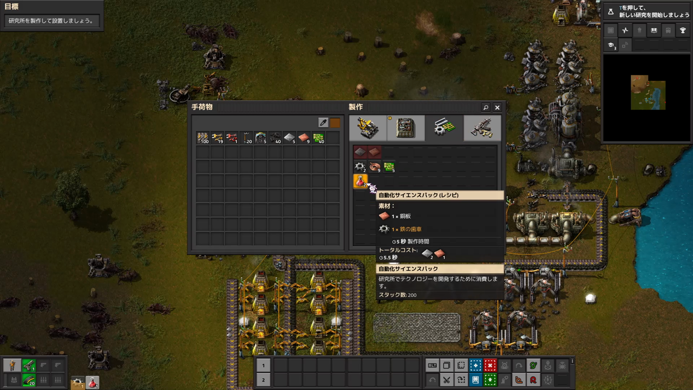

# 4. 要求中間素材作成の操作イメージ



映像は、左側へ現在の手持ち在庫、右側へ分類された作成候補を置き、候補へMouse Overすると必要素材、製作時間、総コスト、出力を表示する。Recipeを実行すると材料が減り、作成した中間品が在庫へ加わるため、「不足している一段を作って次へ進む」という関係が短い操作で理解できる。

Kombinatでは、この分かりやすさを次の形へ拡張する。

1. プレイヤーは原則として最終品と数量または目標在庫だけを指定する。
2. PlannerがRecipe依存を有界DAGへ展開する。
3. 各材料を、在庫あり、予約済み、作成予定、外部搬入待ち、不足へ分類する。
4. 不足中間品は親Requestへ属する子工程として自動作成する。
5. 確定前に、直接材料だけでなく全段を合計した総材料と概算時間を表示する。
6. 一回の確定で全Planを作り、プレイヤーへ中間品ごとの手動発注を要求しない。

## 最小表示

```text
要求: 最終品 × 2

在庫から使用       6
予約済み           4
作成する中間品     3種類 / 9個
外部搬入待ち       2
不足               1種類 / 5個
概算時間           1.8日
```

「作成する中間品」を展開すると、工程ごとに必要数、在庫充当数、作成数、設備、待ち理由を表示する。通常表示では内部`ProductionJob`や`ProductionBatch`の全Recordを見せない。

## 採用しない点

- プレイヤーが全中間品を一個ずつ手動Craftしてから最終品を押すこと。
- 手持ち在庫だけを対象にし、接続StorageとFactory Bufferの確定在庫を無視すること。
- 必要な総材料を示さず、最初の一段だけを作成可能に見せること。
- Recipe循環を無限に展開すること。

## 関連項目

- 上位索引: [kombinat-ui-references](/research/kombinat-ui-references/index.md)
- 発注と多段生産: [発注と多段生産](/kombinat/core/05-発注と多段生産.md)
- 正規UI仕様: [Kombinat UI](/kombinat/core/09-UI-操作画面.md)
- 見積り要件: [UX-002 見積り](/kombinat/requirements/ux-002-見積り.md)
